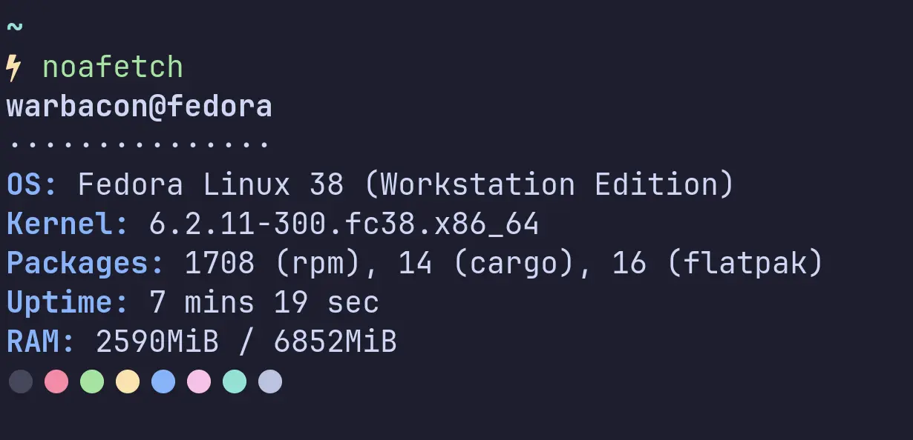

# noafetch (no ascii-art fetch)

Dead simple system information tool but insanely fast written in Rust. Currently this project
**only supports GNU/Linux**, although it could support mac os and windows in the future.



## Compilation

### Requirements

- Cargo
- GCC (although clang could work too, I haven't tried it)

### Instructions

1. Clone this repository and cd into it:

    ```bash
    git clone https://github.com/Warbacon/noafetch.git
    cd ./noafetch
    ```

2. Compile the release version:

    ```bash
    cargo build --release
    ```

3. The compiled binary will be located in ``./target/release/noafetch``. You can copy it to a directory in your ``$PATH``.
For example, if ``~/.local/bin/`` is in your path, you can do:

    ```bash
    cp ./target/release/noafetch ~/.local/bin/
    ```
